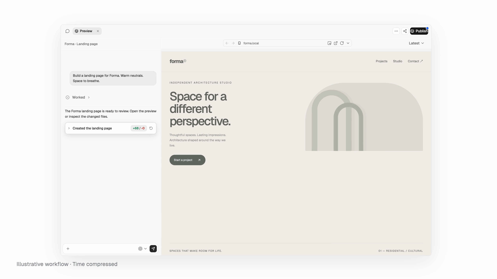
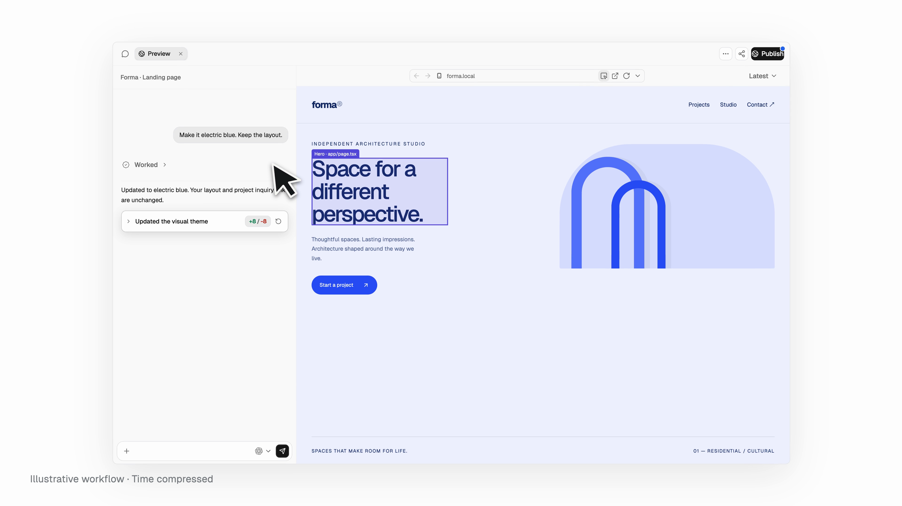

# OpenLink

**프로젝트 중심 오픈 소스 AI 개발 애플리케이션.** OpenLink OSS는 직접 실행하고 확장할 수 있는 기본 애플리케이션입니다. 원하는 제품과 워크플로에 맞게 UI와 서비스를 수정할 수 있습니다.

**언어:** [English](./README.md) · [简体中文](./README.zh-CN.md) · [繁體中文](./README.zh-TW.md) · [日本語](./README.ja-JP.md) · 한국어 · [Français](./README.fr-FR.md) · [Deutsch](./README.de-DE.md) · [Русский](./README.ru-RU.md)

## 목차

- [데모](#데모)
- [주요 기능](#주요-기능)
- [시작하기](#시작하기)
- [저장소 구조](#저장소-구조)
- [맞춤 개발과 업데이트](#맞춤-개발과-업데이트)
- [향후 계획](#향후-계획)
- [문서와 라이선스](#문서와-라이선스)

## 데모

[](./public/openlink/demo/OpenLink-4K60-Paced-001.mp4)

[전체 영상 보기](./public/openlink/demo/OpenLink-4K60-Paced-001.mp4). 영상과 이미지는 예시이며 일부 과정은 시간을 압축해 보여 줍니다.



## 주요 기능

**각 프로젝트가 하나의 완전한 워크스페이스입니다.** 프로젝트마다 `/workspace`의 파일과 Git 기록, 지속되는 실행 환경, 개발 서비스, 애플리케이션 백엔드가 있습니다. 채팅 세션은 프로젝트 경계 안에서 각각 별도의 샌드박스로 실행됩니다. VM 백엔드를 선택하면 프로젝트마다 별도의 Linux 게스트와 커널을 사용합니다. 컨테이너 호환 백엔드는 격리 수준이 낮으며 이를 명확히 표시합니다.[프로젝트 VM](./docs/architecture/ADR-0007-project-vm-runtime-boundaries.md) · [격리 수준](./docs/architecture/ADR-0022-production-deployment-profiles-and-resource-governance.md)

- **한곳에서 구축하고 확인:** 프로젝트 채팅의 Agent, 코드 편집기, 네이티브 미리 보기, 격리된 Chromium 브라우저를 사용할 수 있습니다.[브라우저 설계](./docs/architecture/ADR-0004-browser-runtime-surfaces.md)
- **프로젝트별 백엔드:** 각 Project VM에서 Auth, PostgreSQL, Realtime, Storage, Functions를 포함한 Supabase 호환 서비스를 실행할 수 있습니다. 데이터와 비밀 정보는 OpenLink 제어 영역과 분리됩니다.[런타임](./docs/architecture/standards/04-runtime-lifecycle.md)
- **기본 다중 테넌트 모델:** 사용자, 조직, 워크스페이스, 프로젝트의 소유권을 구분합니다. 서버에서 접근 권한을 다시 확인하고 노출된 테이블에 행 수준 보안을 적용합니다.[데이터와 보안](./docs/architecture/standards/05-data-and-security.md)
- **로컬, Cloud, 지식 서비스:** 로컬과 Cloud는 동일한 계약을 사용하지만 ID와 데이터는 별개입니다. 임베딩 제공자를 설정하면 테넌트 필터가 적용된 의미 검색을 사용할 수 있습니다.[시스템 구성](./docs/architecture/standards/02-system-context.md)

**프로젝트 게시:** 생성된 프로젝트를 지정한 서버 또는 로컬 호스트에 원클릭으로 배포하고 연결 가능한 도메인을 자동 할당하는 기능은 아직 OSS 버전에 도입되지 않았습니다. 향후 OSS 릴리스에 단계적으로 도입할 예정입니다. OpenLink 자체 호스팅과 프로젝트 미리 보기는 별도의 흐름입니다.[설치 문서](./docs/operations/self-hosted-installation.md)

## 시작하기

전체 로컬 환경을 실행하려면 [개발 가이드](./DEVELOPMENT.md)의 가상화 준비와 사전 빌드된 런타임 산출물이 필요합니다. Web 프로세스만 실행해서는 전체 기능을 사용할 수 없습니다.

```bash
git clone https://github.com/Zorker-Tech/Openlink.git
cd Openlink
git switch oss
corepack enable
pnpm install --frozen-lockfile
cp .env.example .env.local
# 환경에 필요한 값을 확인하세요
pnpm dev:local
```

자격 증명을 Git에 커밋하지 마세요. 설정 목록은 [`.env.example`](./.env.example)에 있습니다.

## 저장소 구조

```text
Openlink/
├── app/                 Web 페이지와 API/BFF
├── components/          공통 UI 컴포넌트
├── lib/, utils/         제품 로직과 유틸리티
├── services/            Agent, 브라우저, 지식, 실행 서비스
├── zorkerbase/          데이터 플랫폼과 마이그레이션
├── scripts/, deploy/    실행 관리와 배포 자산
├── docs/                아키텍처, 설계, 운영 문서
├── public/openlink/demo/ 데모 영상과 이미지
├── license/             제삼자 라이선스
├── ARCHITECTURE.md      시스템 경계
├── DEVELOPMENT.md       개발 안내
└── LICENSE.md           저장소 라이선스
```

## 맞춤 개발과 업데이트

변경 사항을 전용 브랜치에 보관하세요. 별도 디렉터리가 필요하면 그 브랜치의 worktree를 만드세요.

```bash
git fetch origin
git worktree add -b my-team/openlink-custom ../Openlink-custom origin/oss
```

디렉터리 하나만 사용한다면 `git switch -c my-team/openlink-custom origin/oss`를 사용할 수 있습니다. 상위 버전이 업데이트되면 맞춤 브랜치에서 `git fetch origin`과 `git merge origin/oss`를 실행하고 충돌을 검토하세요. worktree만으로 아키텍처 이전이 자동 처리되지는 않습니다.

## 향후 계획

재사용 가능한 OSS 구성 요소를 SDK로 정리하고 기능을 확장하며 문서화된 업그레이드 경로를 제공할 계획입니다. 프로젝트 원클릭 게시와 도메인 연결도 향후 목표입니다. 현재 SDK, 자동 이전 또는 완전한 게시 흐름이 제공된다는 뜻은 아닙니다.

## 문서와 라이선스

[개발](./DEVELOPMENT.md) · [아키텍처](./ARCHITECTURE.md) · [설계 결정](./docs/architecture/README.md) · [운영](./docs/operations/README.md)

Issue와 Pull Request를 환영합니다. 저장소 라이선스는 [Apache License 2.0](./LICENSE.md)입니다. 제삼자 자료를 재배포하기 전에 [`license/`](./license/)의 별도 조건을 확인하세요.
