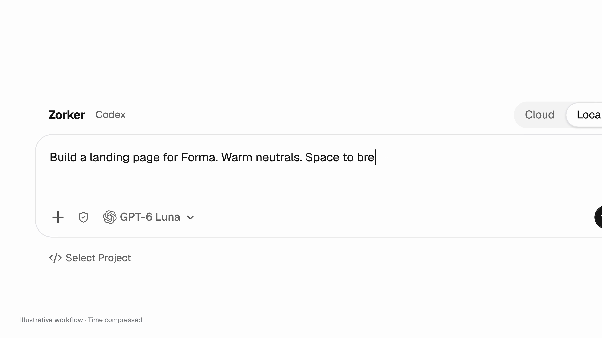

# OpenLink

**面向 AI 构建的开放基础应用。** OpenLink 提供从想法出发、借助 Agent 迭代项目并预览成果的工作流。本仓库是 OpenLink OSS 版本：你可以研究、运行，并根据自己的需求继续开发的应用基础。

**语言：** [English](./README.md) · 简体中文 · [繁體中文](./README.zh-TW.md) · [日本語](./README.ja-JP.md) · [한국어](./README.ko-KR.md) · [Français](./README.fr-FR.md) · [Deutsch](./README.de-DE.md) · [Русский](./README.ru-RU.md)

## 目录

- [了解 OpenLink](#了解-openlink)
- [本仓库提供什么](#本仓库提供什么)
- [OpenLink 的实际能力](#openlink-的实际能力)
- [快速开始](#快速开始)
- [仓库索引树](#仓库索引树)
- [基于 OpenLink 定制开发](#基于-openlink-定制开发)
- [后续方向](#后续方向)
- [文档与贡献](#文档与贡献)
- [许可证](#许可证)

## 了解 OpenLink

[](./public/openlink/demo/OpenLink-4K60-Paced-001.mp4)

**[观看完整演示视频](./public/openlink/demo/OpenLink-4K60-Paced-001.mp4)** · 展示从输入需求到查看预览的工作流。视频和配图用于演示，部分过程经过时间压缩。

| 从想法开始 | 在预览中迭代 |
| --- | --- |
|  |  |

## 本仓库提供什么

OpenLink OSS 是一个**基础应用**，不是功能受限的演示项目。任何用户都可以以此为起点，根据自己的产品或工作流需求，调整界面和服务，并开发更进阶的能力。

仓库包含 Next.js Web 应用、面向前端的 API 层、Agent 与浏览器服务、项目运行时以及本地基础设施。各部分有独立的进程与信任边界，具体关系见[架构说明](./ARCHITECTURE.md)。部分运行时组件和依赖遵循各自的上游许可证，详见[许可证](#许可证)。

## OpenLink 的实际能力

OpenLink 的核心是**一个项目对应一个完整工作空间**，而不是让所有项目共用一个泛化助手。每个项目在 `/workspace` 中拥有自己的文件和 Git 历史、持久化运行时、开发服务及独立的应用后端；不同对话会话在该项目边界内以独立沙箱运行。使用 VM 后端时，每个项目拥有独立的 Linux 虚拟机与客户机内核；可选的容器兼容后端隔离级别较弱，系统会明确标示，不能将其等同于 VM。[ADR-0007](./docs/architecture/ADR-0007-project-vm-runtime-boundaries.md) · [ADR-0022](./docs/architecture/ADR-0022-production-deployment-profiles-and-resource-governance.md)

- **在同一工作区构建与检查。** 在绑定项目的对话中使用 Agent，通过项目代码编辑器检查文件，并在原生预览或隔离的 Chromium 浏览器中查看成果。用户与 Agent 经由受限权限的统一浏览器协议交互。[浏览器运行时设计](./docs/architecture/ADR-0004-browser-runtime-surfaces.md)
- **项目自带应用后端。** 每个 Project VM 可运行独立的 Supabase 兼容后端，提供 Auth、PostgreSQL、Realtime、Storage 和 Functions。项目密钥与数据独立于 OpenLink 控制平面数据库。[运行时生命周期](./docs/architecture/standards/04-runtime-lifecycle.md)
- **原生多租户边界。** 用户、组织、工作空间和项目有明确的所有权；服务端会再次验证访问权限，开放的数据表使用行级安全策略，项目与会话权限按范围授予。[数据与安全标准](./docs/architecture/standards/05-data-and-security.md)
- **本地与托管两种运行模式。** 本地模式启动独立的数据与身份域；Cloud 模式使用相同契约，但独立管理身份和数据。仓库也提供受支持宿主机的 OpenLink 自托管安装与运维说明。[运行时生命周期](./docs/architecture/standards/04-runtime-lifecycle.md) · [自托管安装](./docs/operations/self-hosted-installation.md)
- **按需启用项目知识能力。** 配置真实的嵌入模型提供方后，Knowledge Service 可完成资料摄取，并通过 Zero 执行带租户过滤的语义检索。[系统结构](./docs/architecture/standards/02-system-context.md)

**项目发布：** 将构建成果一键部署到指定服务器或本机，并自动分配已解析域名的能力，尚未引入 OSS 版本；后续会逐步引入。OpenLink 应用自托管与项目预览是不同的使用流程。[浏览器预览决策](./docs/architecture/ADR-0004-browser-runtime-surfaces.md) · [运维文档](./docs/operations/README.md)

## 快速开始

要运行完整的本地开发环境，请先按照[开发指南](./DEVELOPMENT.md)准备宿主机和运行时依赖。本地项目 VM 需要受支持的原生虚拟化环境；应用还会使用事先构建好的本地运行时产物。只启动 Web 进程无法获得完整应用能力。

```bash
git clone https://github.com/Zorker-Tech/Openlink.git
cd Openlink
git switch oss
corepack enable
pnpm install --frozen-lockfile
cp .env.example .env.local
# 检查 .env.local，并填写当前环境所需的配置。
pnpm dev:local
```

[环境变量示例](./.env.example)列出了可用配置。请勿将本地凭据提交到 Git。准备运行时镜像或自托管部署时，请先阅读 [DEVELOPMENT.md](./DEVELOPMENT.md) 和[运维文档](./docs/operations/README.md)中的相应步骤。

## 仓库索引树

```text
Openlink/
├── app/                 Next.js 路由、界面入口及 API/BFF 路由
├── components/          共用界面组件
├── lib/ 和 utils/       产品逻辑与共用工具
├── services/            Agent、浏览器、知识服务及引入的运行时源码
├── zorkerbase/          应用数据平台与迁移文件
├── scripts/             本地生命周期、构建与发布工具
├── deploy/              部署资源
├── docs/                架构、运维与设计文档
├── public/openlink/demo/ 演示视频与配图
├── license/             第三方许可证及署名归集
├── ARCHITECTURE.md      系统边界与架构规则
├── DEVELOPMENT.md       开发环境与协作约定
└── LICENSE.md           本仓库许可证
```

了解系统边界，请先读 [ARCHITECTURE.md](./ARCHITECTURE.md)；开始修改代码前，请阅读 [DEVELOPMENT.md](./DEVELOPMENT.md) 与[架构标准索引](./docs/architecture/standards/README.md)。

## 基于 OpenLink 定制开发

如果要长期基于本仓库开发，建议将定制更改放在**独立分支**。你也可以给该分支创建独立 worktree，让上游 OSS 检出目录与定制版本并存：

```bash
git clone https://github.com/Zorker-Tech/Openlink.git
cd Openlink
git fetch origin
git worktree add -b my-team/openlink-custom ../Openlink-custom origin/oss
```

如果只需要一个工作目录，也可以直接创建并切换分支：

```bash
git switch -c my-team/openlink-custom origin/oss
```

上游更新后，在你的定制分支中合并最新 OSS 更改：

```bash
git fetch origin
git switch my-team/openlink-custom
git merge origin/oss
```

这样可以保留清晰的定制提交，在未来 OpenLink 发生较大架构变更时，逐项审查并解决冲突，避免直接覆盖你们的修改。worktree 只是分支的独立工作目录，不能代替分支，也不会自动完成迁移。升级已部署环境前，请检查发布说明、数据库迁移和服务契约变化。

## 后续方向

当前版本提供的是可直接扩展的应用。后续开发中，我们计划逐步将适合复用的 OSS 功能组件整理为 SDK，拓展更多能力，将项目一键发布到指定服务器或本机并自动分配域名的能力逐步引入 OSS，同时为基于本应用开发的项目提供有文档支持的升级渠道。这些是**未来规划**；上述 SDK、一键项目发布和自动迁移尚未在 OSS 版本中提供。

我们希望开发者能持续完善自己的 OpenLink 定制版本，同时方便地吸收上游改进。从现在起将定制更改保存在独立分支，有助于未来审查并整合架构更新。

## 文档与贡献

- [开发指南](./DEVELOPMENT.md)：本地工作流、宿主机前提条件与开发约定。
- [架构说明](./ARCHITECTURE.md)：系统结构、职责与信任边界。
- [架构决策](./docs/architecture/README.md)：已接受的设计决策。
- [运维文档](./docs/operations/README.md)：自托管与维护资料。

欢迎提交 Issue 和 Pull Request。涉及服务边界的改动，请先阅读相关架构标准，并说明迁移影响。请勿在贡献中包含密钥、生成的运行时状态或本地产物。

## 许可证

OpenLink 仓库采用 [Apache License 2.0](./LICENSE.md)。第三方源码和资源可能适用不同条款；再分发前请查阅 [`license/`](./license/) 中归集的声明及相应组件的许可证。
