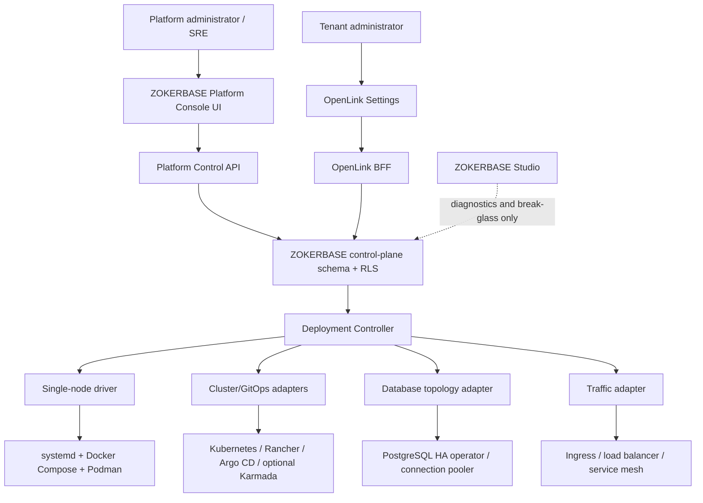
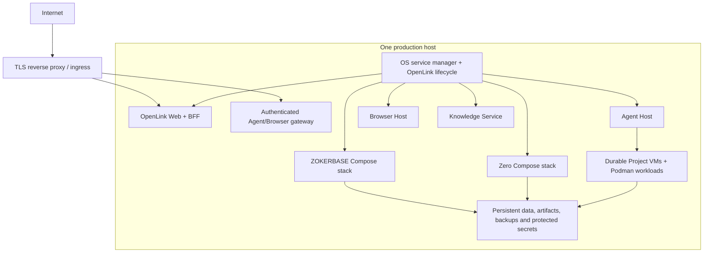

# ADR-0020: Establish ZOKERBASE Platform Console as the product platform control plane

## Status

Accepted

## Context

OpenLink currently has one root lifecycle that can start a complete Local
product on one host. ZOKERBASE and Zero run through Docker Compose, privileged
OpenLink services run as supervised Node.js processes, and Project workloads
run inside durable Project VMs through Podman. This is a useful production-shaped
single-host foundation, but it is not yet a packaged single-node production
deployment and it does not provide a multi-node or multi-cluster control plane.

The product needs three different administrative experiences whose audiences
and privileges must not be conflated:

1. OpenLink Settings is the application-facing settings surface for a tenant or
   organization. It manages only resources and policy delegated to that tenant.
2. ZOKERBASE Studio is the database engineering and break-glass surface for
   SQL, schemas, Auth, Storage, logs and other data-platform internals.
3. Platform operators need a product-wide surface for tenants, environments,
   releases, infrastructure, traffic, database topology, operations, incidents
   and audit history.

Existing open-source systems already implement difficult infrastructure
capabilities such as Kubernetes cluster lifecycle, GitOps reconciliation,
multi-cluster placement, ingress, and PostgreSQL high availability. Rebuilding
those systems would add operational and security risk. Exposing their native
consoles as the product control plane would instead fragment identity, policy,
audit and desired state across several management systems.

The immediate delivery requirement is narrower: make a single machine a
repeatable, supportable production target before introducing distributed
deployment. The design must preserve a clean path to load-balanced multi-node
and multi-cluster operation without making Rancher, Kubernetes, Argo CD or a
database operator prerequisites for single-node installation.

## Decision

### One logical platform control plane

ZOKERBASE Platform Console is the single logical product platform control
plane. It consists of several independently secured components rather than one
privileged web process:



ZOKERBASE is the authoritative store for product identity, tenancy,
authorization, desired platform state, operation history and audit records.
The Platform Control API is the only browser-facing interface for privileged
platform operations. The Deployment Controller is a separate privileged
service that reconciles desired state against infrastructure APIs. It is part
of the ZOKERBASE Platform Console product boundary, but it is not embedded in
the PostgreSQL process, the Studio frontend or OpenLink's tenant-facing BFF.

There is no second OpenLink-owned configuration database for deployment. An
infrastructure component remains authoritative for its own live runtime state:
Kubernetes owns Kubernetes objects, a database operator owns replication and
failover state, and a load balancer owns active routing state. ZOKERBASE stores
the product intent and a timestamped observed-state projection so the Console
can present one coherent view without pretending that a stale projection is
live infrastructure truth.

### Administrative surface boundaries

| Surface | Audience | Owns | Must not own |
| --- | --- | --- | --- |
| OpenLink Settings | Tenant and organization administrators | Tenant members, projects, provider settings, user/organization entitlements and delegated quotas, tenant environments and deployment requests | Host or cluster capacity, cluster credentials, nodes belonging to other tenants, global routing, database failover or platform release authority |
| ZOKERBASE Platform Console | Platform administrators and SREs | Global tenant inventory, infrastructure capacity, environments, releases, deployments, clusters, traffic, database topology, incidents, operations and audit | User/organization entitlement editing, direct shell execution in the browser, raw infrastructure credentials or tenant application workflows |
| ZOKERBASE Studio | Database engineers and break-glass SREs | Database inspection and data-platform diagnostics | Primary deployment workflow, product tenancy administration or infrastructure desired state |
| Native infrastructure consoles | Restricted SREs | Deep component diagnostics and emergency repair | Product tenancy, product policy or an alternative source of deployment intent |

Routine platform actions are performed inside ZOKERBASE Platform Console. The
Console creates an asynchronous operation and the Controller calls the relevant
component API. Native Rancher, Argo CD, Kubernetes, database-operator and
observability consoles are deep links for diagnosis or break-glass recovery;
they are not the normal path for releases, scaling, rollback or traffic changes.

### Control-plane resource model

The authoritative schema will model resources rather than copying a particular
infrastructure provider's API. Exact table names may be refined in a schema
design, but the following identities and relationships are binding:

| Resource | Purpose |
| --- | --- |
| Tenant and organization | Product ownership and identity reference; OpenLink Settings remains the authority for user/organization resource entitlements and delegation |
| Environment | Named development, staging or production boundary owned by a tenant or by the platform |
| Deployment target | A single-node host, Kubernetes cluster or future provider target |
| Cluster and node inventory | Capacity, architecture, region, health and maintenance state |
| Release | Immutable product version and signed artifact manifest |
| Deployment | Desired release, target, topology, capacity and rollout policy |
| Service topology | Desired replicas and placement for stateless product services |
| Database topology | Desired primary, replicas, poolers, backup and failover policy |
| Traffic policy | Hostnames, routes, weights, health gates and cutover state |
| Operation | Idempotent asynchronous install, upgrade, scale, migrate, rollback, backup, restore or failover job |
| Observed resource status | Controller generation, health, component references and last successful observation |
| Secret reference | Reference to an external or host-protected secret; never raw secret material returned to a browser |
| Audit event | Immutable actor, request, authorization result, resource, operation and outcome record |

Every mutable desired-state resource has a monotonically increasing generation.
Observed status records the generation the Controller has reconciled. A
resource cannot be reported ready when the observed generation is older than
the desired generation or when a mandatory dependency is unhealthy.

### Reconciliation and operation model

Platform changes use an asynchronous, idempotent command/reconciliation model:

```text
authorized request
  -> validate scope, policy, capacity and release signature
  -> atomically write desired generation + operation + audit event
  -> controller acquires a scoped lease
  -> driver applies the desired state
  -> controller observes component-native health
  -> observed generation becomes ready, degraded or failed
  -> operation and audit outcome become terminal
```

Operations use explicit states: `queued`, `validating`, `applying`,
`verifying`, `ready`, `degraded`, `failed`, `rolling_back`, `rolled_back` and
`cancelled`. Repeating the same operation key must resume or return the existing
operation rather than create conflicting work. Controllers use leases and
fencing tokens so two replicas cannot mutate the same deployment concurrently.
Failed operations preserve diagnostics with secret redaction; they do not make
the desired resource appear ready. Rollback is an explicit operation against a
known compatible release and never silently reinterprets persisted state.

The Controller does not accept arbitrary shell text, manifests or endpoints
from the browser. Product policy compiles validated resource intent into a
versioned driver contract. Provider-specific identifiers remain server-side.

### Current delivery profile: single-node production

Single-node production is the only implementation priority under this ADR.
Multi-node and multi-cluster components are architectural extension points and
must not enter the single-node installation or startup dependency graph.

[ADR-0022](./ADR-0022-production-deployment-profiles-and-resource-governance.md)
now defines the concrete single-node profiles and supersedes the diagram below
where it shows one unconditional topology: Core omits Knowledge Service and
Zero, while Project execution independently selects the VM or Container
backend. This does not change the Platform Console boundaries in this ADR.

The supported topology is:



The production package must separate artifact production from runtime startup.
CI/release production builds and signs the Next.js bundle, service bundles,
container images, Podman toolchain and platform-specific Project VM Golden
Disks. Ordinary service startup verifies installed manifests and starts only
prebuilt artifacts; it never runs package installation, source compilation or
upstream image acquisition.

The single-node profile must provide one supported operator command or service
entry point with the following lifecycle:

1. preflight OS, architecture, disk, memory, ports, time synchronization,
   container engine, virtualization and artifact signatures;
2. validate configuration and secret references without printing secrets;
3. acquire an exclusive host lifecycle lock;
4. back up state required by an impending schema or artifact upgrade;
5. start ZOKERBASE and apply forward migrations;
6. start Zero and privileged OpenLink services in dependency order;
7. wait for dependency-aware readiness before admitting public traffic;
8. record the installed release, configuration fingerprint and observed health;
9. support status, logs, stop, restart, backup, restore, upgrade and rollback;
10. preserve ZOKERBASE, Zero, Project VM disks, Git workspaces, browser
    profiles, provider credentials and release rollback artifacts on restart.

The operating-system service manager restarts the root lifecycle after a
process or host reboot. The external edge owns TLS renewal, request limits and
public exposure; every privileged service remains on loopback or a private
socket. Only the Web/BFF and explicitly authenticated Browser/Agent gateway
routes are public.

Single-node production is not described as highly available. A host failure
causes service interruption. Its reliability promise comes from durable state,
verified backups, restore rehearsal, idempotent startup and release rollback.
Availability, RPO, RTO and retention values are deployment configuration with
measured acceptance tests; this ADR does not invent numeric guarantees before
production telemetry and recovery exercises exist.

### Future profile: load-balanced multi-node and multi-cluster

After single-node production passes its release and recovery gates, the same
resource and operation contracts may gain distributed drivers:

- Kubernetes or a compatible orchestrator runs stateless Web/BFF, Agent Host,
  Browser Host and Knowledge Service replicas behind health-gated load
  balancing.
- Rancher or an equivalent cluster manager may provide cluster registration,
  credentials, inventory and low-level operations behind an adapter.
- Argo CD or Flux may provide GitOps release reconciliation and rollback.
- Karmada or an equivalent placement layer is introduced only when one
  deployment must span multiple Kubernetes clusters; it is not required merely
  to operate multiple independent clusters.
- A PostgreSQL HA operator owns replication, primary election, backups and
  recovery. A pooler/proxy exposes explicit read-write and, where application
  semantics permit replication lag, read-only endpoints.
- Ingress, a cloud load balancer or a service mesh owns active traffic. The
  ZOKERBASE traffic policy remains the product intent and audit source.

These are replaceable capability adapters, not product sources of truth. The
first distributed design must select and pin exact implementations only after
capacity, region, availability, cost, RPO/RTO and operator-skill requirements
are known. A deep fork or rebranding of an upstream management UI is not the
default strategy; API integration and restricted diagnostic deep links preserve
upstream upgradeability.

### Database load balancing and control-plane bootstrap

ZOKERBASE Platform Console manages database topology as desired state, but the
ZOKERBASE application database does not perform its own replication, election
or network load balancing. Those responsibilities belong to the database
runtime, HA operator and connection proxy. OpenLink services use a stable
read-write endpoint for transactions. Read-only routing is introduced only for
queries whose consistency requirements explicitly tolerate replica lag and
whose authorization context remains correct.

The Platform Console cannot be the only recovery mechanism for the database
that stores its own desired state. This bootstrap boundary is intentional:

- in single-node production, the OS service manager, offline release manifest,
  host-protected secrets and tested backup/restore tooling can recover the
  control plane without the Console;
- in distributed production, the infrastructure orchestrator and database HA
  operator can restore the ZOKERBASE control-plane database before Controller
  reconciliation resumes;
- break-glass access is separately authenticated, narrowly authorized, audited
  where the data store is available and documented for offline recovery.

This recovery substrate is not a second product management plane. It cannot
change product tenancy or deployment intent during normal operation.

## Security requirements

- Platform roles are separate from tenant roles. A tenant administrator never
  becomes a platform administrator through organization membership.
- Platform administration requires strong authentication and must support MFA;
  destructive or cross-tenant operations require explicit reauthorization and
  may require approval policy in a later phase.
- Browser clients receive neither database service-role keys nor Kubernetes,
  Rancher, Argo CD, SSH, load-balancer or database-operator credentials.
- Controller credentials are scoped per target and operation capability,
  encrypted or stored in a platform secret store, rotated independently and
  represented in ZOKERBASE only by references and metadata.
- Every cross-tenant read and mutation is authorized server-side and produces
  an audit event. Infrastructure responses are treated as untrusted input and
  are normalized before storage or rendering.
- Public control APIs use rate limits, anti-replay/idempotency keys and request
  size bounds. Controller callbacks and watch streams use authenticated private
  transport.
- Native infrastructure consoles are unavailable to tenant users. Break-glass
  sessions are time-limited and do not reuse ordinary application sessions.

## Availability, failure and degradation

| Failure | Required behavior |
| --- | --- |
| Platform Console UI unavailable | Existing workloads continue; operators may use documented status and recovery commands |
| Platform Control API unavailable | No new desired state is accepted; existing workloads continue |
| ZOKERBASE unavailable | Controllers stop accepting new work and do not guess intent; bootstrap recovery restores the authority store |
| Controller unavailable | Desired state remains durable; a restarted controller resumes by generation and idempotency key |
| Infrastructure API unavailable | Operation becomes retryable/degraded with bounded backoff; current healthy deployment is preserved |
| Stale observed projection | Console labels it stale and shows observation time; it must not report ready |
| Release verification fails | No runtime mutation occurs and the rejected artifact is recorded without secrets |
| Upgrade health gate fails | Stop rollout and execute the declared rollback/restore path; retain failure evidence |
| Audit write fails | Privileged mutation fails closed unless executing a separately defined offline disaster-recovery procedure |
| Single production host fails | Service is unavailable until host or replacement restoration; backups and release artifacts remain the recovery source |

## Delivery phases and gates

### Phase 0 — architecture contract (this decision)

- Establish the vocabulary, ownership, desired/observed state and trust
  boundaries in this ADR.
- Do not add Rancher, Kubernetes, Argo CD, Karmada or a database HA operator to
  the current product runtime.
- Keep OpenLink Settings tenant-facing and ZOKERBASE Studio diagnostic-only.

### Phase 1 — complete single-node production

- Produce a versioned, signed, offline-restorable release artifact set.
- Replace build/install-on-start behavior with runtime-only startup.
- Add a supported host service definition, edge/TLS profile and one operator
  CLI for install, preflight, start, readiness, stop, status and logs.
- Define persistent paths, ownership, disk-capacity gates and secret handling.
- Add transactional migration, backup, restore, upgrade and rollback workflows.
- Add structured logs, metrics, readiness, dependency health and actionable
  diagnostics without exposing privileged ports.
- Validate clean install, reboot restart, application restart, interrupted
  upgrade, rollback, backup restore and loss-of-registry operation on every
  supported host platform.

Phase 1 is complete only when ordinary startup uses no source compilation or
package installation, a release can be rolled back without losing compatible
durable state, and a replacement host can restore documented state from a
tested backup.

### Phase 2 — Platform Console foundation

- Add the platform resource, operation, observed-state and audit schema.
- Add the Platform Control API and platform-administrator authorization model.
- Add the Deployment Controller contract and single-node driver.
- Add the initial Platform Console views for environments, releases,
  deployments, operations, health and audit.
- Keep native component consoles restricted to SRE diagnostic access.

### Phase 3 — load-balanced multi-node

- Define measured capacity, availability, region, cost and recovery targets.
- Select and pin the orchestrator, GitOps, traffic and PostgreSQL HA adapters.
- Run stateless services as multiple health-gated replicas.
- Migrate control-plane data through backup, restore, validation and explicit
  cutover rather than mutating single-node storage in place.
- Exercise node loss, controller loss, primary database failover, partial
  rollout, rollback and traffic cutover.

### Phase 4 — multi-cluster

- Add cluster inventory and per-cluster credentials behind the adapter
  contract.
- Add placement, regional failure and cross-cluster traffic policies only from
  demonstrated requirements.
- Introduce a multi-cluster placement component only when workloads must span
  clusters; independent clusters do not require it.
- Preserve one ZOKERBASE authority, operation log and audit experience.

## Consequences

### Positive

- Platform operators receive one product control plane rather than several
  unrelated infrastructure dashboards.
- OpenLink Settings remains safe and comprehensible for tenants.
- Mature open-source infrastructure capabilities can be reused without making
  their schemas or UIs the product domain model.
- Desired state, observed state, operations and audit have explicit ownership.
- Single-node production can mature without paying the operational cost of a
  distributed stack prematurely.
- The single-node driver establishes contracts that future cluster drivers can
  implement instead of creating a separate deployment product.

### Negative

- The Platform Control API, Controller, adapters and Console remain substantial
  OpenLink-owned software even though infrastructure engines are reused.
- State projection introduces eventual consistency and requires visible
  freshness/generation semantics.
- Platform and break-glass identities, secrets and recovery procedures add
  operational responsibilities.
- Single-node production deliberately accepts host-level downtime until the
  multi-node phase is implemented.

### Operational

- Operators must distinguish product intent in ZOKERBASE from component-native
  live state during incidents.
- Upstream native consoles remain installed only where they are required for
  diagnostics and must be upgraded and secured as dependencies.
- Every new driver requires contract, failure-injection, idempotency, upgrade
  and rollback tests before it becomes a supported deployment target.

## Alternatives considered

### Put platform deployment controls in OpenLink Settings

Rejected because OpenLink Settings is a tenant-scoped product surface. Giving
it cluster, global traffic, database failover or cross-tenant authority would
collapse tenant and platform trust boundaries.

### Extend ZOKERBASE Studio into the platform console

Rejected because Studio is a database engineering surface based on vendored
upstream code. Mixing product deployment workflows into it would couple
infrastructure security and release cadence to upstream database UI changes.
Studio remains useful for restricted diagnostics and break-glass recovery.

### Rebrand and deeply fork one open-source multi-cluster UI

Rejected as the default because its domain model is infrastructure-first, not
tenant/product-first, and a deep UI fork would make security and upstream
upgrades expensive. Such a system may be used behind an adapter and exposed by
restricted diagnostic deep links.

### Make Rancher, Argo CD or Kubernetes the product source of truth

Rejected because no single infrastructure tool owns the combined product and
platform concerns of tenant inventory, infrastructure capacity, releases,
database topology and audit. User/organization entitlements remain in the
OpenLink application domain as refined by
[ADR-0022](./ADR-0022-production-deployment-profiles-and-resource-governance.md).
It would also make single-node production depend on distributed infrastructure.

### Build cluster, GitOps and database HA engines from scratch

Rejected because these are mature, high-risk infrastructure capabilities. The
product should own policy, contracts, reconciliation and user experience while
reusing reviewed implementations.

### Implement multi-node before hardening single-node

Rejected because the current release/start separation, host supervision,
backup/restore, rollback and observability gaps would be multiplied across
nodes. Single-node production is the required proving ground for those
contracts.

## References

- [`ARCHITECTURE.md`](../../ARCHITECTURE.md)
- [`standards/02-system-context.md`](./standards/02-system-context.md)
- [`standards/03-repository-boundaries.md`](./standards/03-repository-boundaries.md)
- [`standards/04-runtime-lifecycle.md`](./standards/04-runtime-lifecycle.md)
- [`standards/05-data-and-security.md`](./standards/05-data-and-security.md)
- [`standards/07-non-functional-requirements.md`](./standards/07-non-functional-requirements.md)
- [`ADR-0013-local-cloud-persistence-runtime.md`](./ADR-0013-local-cloud-persistence-runtime.md)
- [`ADR-0019-native-host-platform-runtime.md`](./ADR-0019-native-host-platform-runtime.md)
