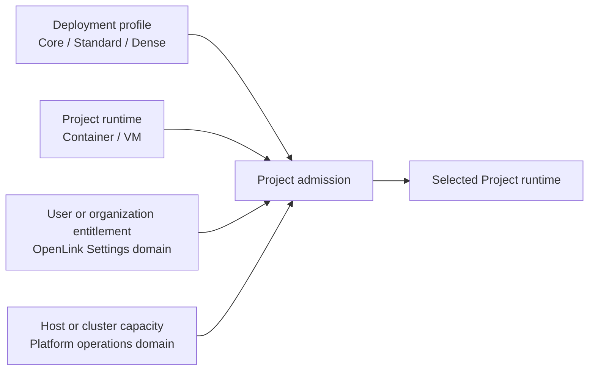
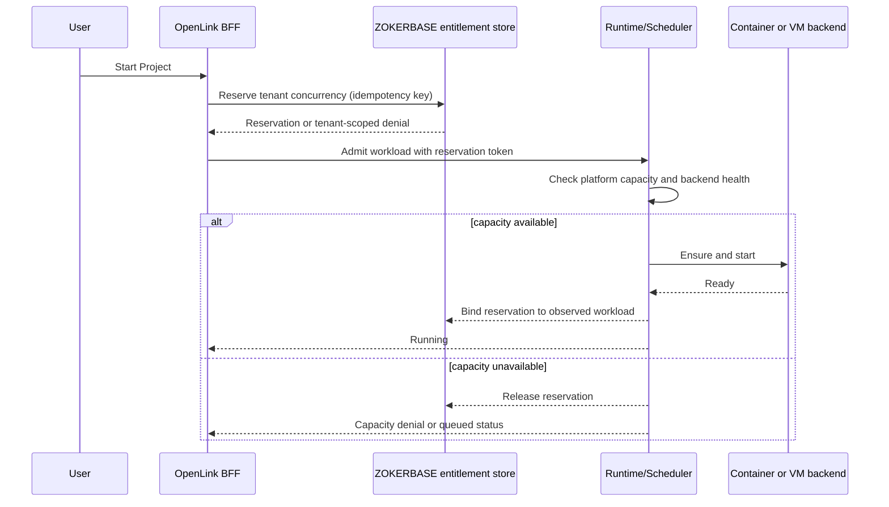

# ADR-0022: Define production deployment profiles and resource-governance boundaries

## Status

Accepted

## Context

OpenLink must run on hosts with different resource and virtualization
capabilities. The current production-shaped runtime assumes every Project runs
inside a Project VM and therefore requires KVM on Linux or Apple Hypervisor on
macOS. That is the preferred isolation boundary, but it prevents installation
on otherwise useful hosts where hardware virtualization is unavailable,
disabled by firmware, or not exposed by a cloud or nested-virtualization
provider.

Earlier SSH development deployments did not have this requirement because
Project services ran directly in Docker containers on the remote Linux host.
That topology provided the product behavior needed for development, but it did
not provide an independent guest kernel or a VM security boundary. A Docker
container and a Project VM are therefore two different execution contracts;
they must not be presented as equivalent isolation.

Production sizing and execution have four independent concerns that must not be
collapsed into one installation-time number:

1. A deployment profile describes enabled product components, the host
   baseline and the default resources assigned to a Project workload.
2. A Project runtime backend selects container or VM isolation independently
   from the deployment profile.
3. A tenant entitlement limits how many Project workloads a user or
   organization may run concurrently.
4. Platform capacity limits how many workloads the whole deployment or cluster
   can safely admit at a particular time.

Project concurrency cannot be permanently fixed during installation. A user's
or organization's entitlement can change with its plan, and available
platform capacity can change as nodes are resized or added. Single-node,
load-balanced and Cloud deployments must use the same tenant-facing resource
model while retaining separate infrastructure authority.

This decision extends the administrative boundaries established by
[ADR-0020](./ADR-0020-zokerbase-platform-console.md), and is authoritative when
an older, broader reference to quota could be read differently. It also extends the sealed
self-hosted runtime contract established by
[ADR-0021](./ADR-0021-sealed-self-hosted-production-distribution.md).

## Requirements

### Functional requirements

- Provide named `core`, `standard` and `dense` production deployment profiles.
- Keep deployment profile and Project runtime backend independently selectable.
- Do not start the built-in Knowledge Service or Zero in Core.
- Allow every profile to use the Container backend without KVM or Apple
  Hypervisor.
- Preserve full Project VM semantics when any profile uses the VM backend.
- Detect required host capabilities before starting workloads.
- Keep the selected profile and observed runtime backend visible to operators.
- Allow the default per-Project resource shape to change after installation.
- Allow user and organization Project concurrency entitlements to change
  without reinstalling or changing the deployment profile.
- Enforce tenant entitlement and infrastructure capacity independently and
  atomically when admitting a Project workload.
- Use the same tenant quota semantics in single-node, load-balanced and Cloud
  deployments.

### Non-functional requirements

- A runtime must never silently weaken a requested VM isolation boundary.
- Resource decisions must be auditable and attributable to an actor and policy
  version.
- Concurrent admission requests must not exceed a tenant entitlement through a
  race condition.
- A transient loss of the Settings UI must not terminate already admitted
  workloads.
- A control-plane outage must fail closed for new admissions when authoritative
  quota or capacity state cannot be established safely.
- Profile changes and quota changes must be reversible and must not destroy
  Project data.
- Runtime metrics must distinguish entitlement denial, capacity exhaustion,
  host incompatibility and workload failure.

### Non-goals

- This ADR does not implement multi-node scheduling, database high availability
  or load balancing.
- This ADR does not define product prices or commercial plan names.
- This ADR does not make ZOKERBASE Studio a deployment control plane.
- This ADR does not claim that a Docker container has a Project VM security
  boundary.
- This ADR does not permit tenant administrators to manage host, cluster or
  product-wide capacity.

## Decision

### Four separate policy axes

OpenLink will model deployment sizing, Project isolation, tenant entitlement
and platform capacity as independent policy axes:



The effective admission result is not a stored Project-count constant. It is a
decision made from the current tenant entitlement, current reservations and
current infrastructure capacity:

```text
admit = tenant entitlement has capacity
    AND platform scheduler has capacity
    AND selected runtime backend is healthy
```

Neither side may substitute for the other. Unused tenant entitlement does not
guarantee physical capacity, and spare physical capacity does not authorize a
tenant to exceed its entitlement.

### Deployment profiles

The first production profile revision uses the following baselines. Values are
versioned defaults, not permanent licensing limits. Operators may choose a
larger host, and authorized reconfiguration may change Project defaults after
preflight succeeds.

| Profile | Enabled product components | Host baseline | Default Project shape | Intended use |
| --- | --- | --- | --- | --- |
| Core | OpenLink application and data platform; built-in Knowledge Service and Zero disabled | 4 logical CPU, 16 GiB RAM, 100 GiB free state storage | 2 vCPU, 4 GiB RAM, 40 GiB storage budget | Deliberately reduced product surface for smaller or compatibility-focused self-hosting |
| Standard | Complete product, including built-in Knowledge Service and Zero | 8 logical CPU, 32 GiB RAM, 200 GiB free state storage | 4 vCPU, 8 GiB RAM, 64 GiB storage budget or virtual disk | Default complete production deployment |
| Dense | Complete product, including built-in Knowledge Service and Zero | 16 logical CPU, 64 GiB RAM, 500 GiB free state storage | 2 vCPU, 6 GiB RAM, 64 GiB storage budget or virtual disk | Higher Project density on a large host |

Dense means a higher-density resource policy, not weaker isolation and not an
unlimited Project count. Its smaller default CPU allocation is a scheduling
default; an individual Project may receive another approved resource class.
Memory and storage overcommit are disabled initially. CPU may be shared within
an explicit scheduler policy, but admission must retain enough reserved memory
and storage for all admitted workloads plus the platform reserve.

Profile revisions will be identified independently from product releases, for
example `standard/v1`. A release may raise a profile minimum only through an
explicit compatibility declaration and upgrade preflight.

### Runtime contracts

Every profile may use the `container` or `vm` backend. Profile selection does
not imply an isolation class.

The `container` backend gives each Project a separately named container group,
network namespace, volumes, credentials and resource limits, but it shares the
host kernel. The UI and operational status must label this backend **Docker
compatibility mode** and display `container` as its isolation class. Standard +
Container and Dense + Container retain their complete product component set
and resource policy; they do not become Core merely because KVM is absent.

The `vm` backend uses QEMU accelerated by KVM on Linux and `vfkit` accelerated
by Apple Hypervisor on macOS, with `gvproxy` for networking. Project services,
including their container engine, run inside the guest. The reported isolation
class is `vm`.

Both backends implement one versioned `ProjectRuntime` contract:

- ensure or provision;
- start and wait for readiness;
- execute an argument vector without shell reinterpretation;
- copy declared artifacts;
- inspect observed state and resource use;
- stop, suspend, resume and remove;
- expose declared service endpoints;
- emit lifecycle and audit events.

Backend-specific capability fields remain visible. Callers must not infer VM
features from the common API. Features such as guest-kernel configuration,
VM snapshots, device passthrough or attested boot declare
`requiresIsolation: vm` and are rejected on Core with a stable
`RUNTIME_CAPABILITY_UNAVAILABLE` error.

### Selection, detection and degradation rules

The deployment profile is explicit desired state. Installation may recommend a
profile after detection, but startup does not automatically change an existing
profile.

- The Container backend requires a healthy Docker Engine and Compose support.
  KVM and AppleHV are not required.
- The VM backend on Linux requires CPU virtualization flags, the appropriate
  KVM kernel modules, usable `/dev/kvm`, and the pinned QEMU/runtime helpers.
- The VM backend on macOS requires `kern.hv_support=1` and the sealed `vfkit`
  and `gvproxy` artifacts.
- Linux startup may load already installed `kvm`, `kvm_intel` or `kvm_amd`
  modules and configure the dedicated service identity's device access.
- Release installation may install declared host packages only through an
  explicit, auditable bootstrap operation. Normal production startup remains
  offline and does not download packages.
- Firmware VT-x/SVM, cloud nested virtualization and Apple Hypervisor support
  cannot be enabled by the application. Their absence produces an actionable
  preflight failure.

No profile silently changes its runtime backend. If Linux VM preflight fails,
an interactive CLI may offer to enable locally available KVM support, retain
the same profile and select Container, show the matching repair guide, or exit. A
Container selection is an explicit isolation change but not a profile
downgrade. Core is not presented as a virtualization workaround because it
would remove product features without solving the missing VM capability.
Non-interactive startup fails unless its policy explicitly chooses
and acknowledges Container. Moving from Container to VM requires the VM
backend and all existing Project data to pass migration verification.

### Configuration ownership and mutability

The deployment CLI owns only host-level desired state:

- deployment profile and profile revision;
- independently selected Project runtime backend;
- host paths, public endpoints and certificates;
- service resource envelope and platform reserve;
- optional per-Project resource-class defaults;
- backup, retention and upgrade policy.

The initial interface will expose the equivalent of:

```text
openlinkctl install --profile core|standard|dense
openlinkctl install --project-runtime container|vm|auto
openlinkctl profile show
openlinkctl profile plan standard
openlinkctl profile apply standard
```

`auto` is an installation-time request to detect and confirm a concrete
backend; persisted desired state is always `container` or `vm`. `profile plan`
is read-only and reports capability checks, data migration, required downtime
and capacity impact. `profile apply` uses the existing
lifecycle lock, backup and rollback contracts. It never changes a user or
organization entitlement.

Configuration persists both `desiredProfile` and observed facts including
`runtimeBackend`, `isolationClass`, `profileRevision` and the last successful
capability check. Environment variables may be a compatibility input, but the
versioned configuration model is authoritative; profile behavior must not be
spread across unrelated ad hoc variables.

### Absolute OpenLink Settings boundary

OpenLink Settings owns only OpenLink application resources scoped to the
authenticated user or organization. This rule is invariant across single-node,
load-balanced, multi-cluster and Cloud deployments.

OpenLink Settings may:

- display a user's personal plan entitlement and current Project usage;
- display an organization's entitlement and aggregate member usage;
- let an organization owner or administrator delegate the organization's
  available concurrency to members or teams;
- update tenant-scoped limits within an authoritative plan or contract ceiling;
- show why a tenant-scoped admission was denied;
- request a plan change through the applicable billing or contract workflow.

OpenLink Settings must never:

- set host, node, cluster or region capacity;
- select Core, Standard or Dense;
- enable KVM, AppleHV, QEMU, Docker, Kubernetes or load balancing;
- change global concurrency, scheduler overcommit or placement policy;
- inspect other tenants' usage or infrastructure inventory;
- operate database topology, backups, failover, releases or traffic;
- turn spare infrastructure into tenant entitlement;
- override a platform-capacity denial.

This is not merely a UI convention. The tenant-facing BFF and database
authorization policies must make these global operations impossible from an
OpenLink Settings credential.

### ZOKERBASE Platform Console boundary

ZOKERBASE Platform Console is the future platform-operator surface. It owns
global and infrastructure-scoped policy:

- aggregate admission capacity and safety reserves;
- node inventory, health and allocatable CPU, memory and storage;
- cluster-wide concurrent workload ceiling;
- placement, draining, overcommit and maintenance policy;
- deployment profiles available to each target;
- multi-node rollout, load balancing and database topology;
- global operational audit and capacity forecasting.

It does not manage a user's personal plan, an organization's member allocation
or normal tenant workflows. It may observe tenant identifiers and aggregate
usage where required for scheduling and incident response, but it does not
become the tenant entitlement editor.

Until the Platform Console and multi-node scheduler exist, the single-node
lifecycle owns a local platform-capacity policy derived from the selected
profile, live host measurements and configured safety reserve. This temporary
operator mechanism is not exposed in OpenLink Settings and does not create a
second tenant quota store.

### ZOKERBASE Studio boundary

ZOKERBASE Studio remains a database engineering and break-glass diagnostics
surface. It owns neither tenant entitlements nor deployment capacity. Editing
quota or scheduler tables directly through Studio is unsupported and must be
detectable by audit and integrity controls.

### Tenant entitlement model

Tenant entitlement is stored in ZOKERBASE as application-domain data and
accessed through scoped application APIs. The logical model contains:

| Record | Purpose |
| --- | --- |
| `resource_entitlement` | Server-authoritative ceiling for a personal user or organization, sourced from plan, contract or Cloud commerce |
| `resource_allocation` | Organization-admin delegation of part of an organization entitlement to a member or team |
| `resource_reservation` | Atomic reservation for a provisioning, starting or running Project workload |
| `resource_usage_projection` | Rebuildable observed usage for UI and reporting; not the admission authority |
| `resource_policy_revision` | Version and effective interval of the policy used by an admission decision |

Exact table names may change during schema design. The following semantics are
binding:

- Personal Projects consume the personal entitlement.
- Organization Projects consume the organization entitlement and any applicable
  member allocation; they do not also consume the member's personal plan.
- A workload counts against concurrency from the first successful reservation
  through terminal stop or removal. `provisioning`, `starting`, `running` and
  `stopping` count; fully `stopped` or failed-and-cleaned workloads do not.
- Reservations use a database transaction and unique idempotency key. The
  authoritative count is never computed only from a stale metrics projection.
- Entitlement increases apply immediately to new admissions.
- Entitlement decreases do not kill healthy running workloads by default. The
  scope enters `over_limit`, new admissions are denied, and usage must drain
  below the new ceiling. Explicit forced enforcement is a separately
  authorized and audited operation.
- Unlimited is represented explicitly, never as an arbitrary large integer.
- Every denial identifies whether the cause is tenant entitlement, member
  allocation, platform capacity or runtime health without exposing another
  tenant's data.

### Admission flow



For the first single-node implementation, capacity exhaustion returns a clear
retryable denial. Queueing is deferred until fairness, cancellation and lease
semantics are implemented. Multi-node scheduling may later reserve platform
capacity before tenant capacity or combine both under a saga, but it must
retain idempotent compensation and the same observable outcome.

### Security model

- Tenant quota mutation requires authenticated user or organization authority
  and row-level authorization for the exact scope.
- Plan-entitlement mutation requires a trusted billing, license or contract
  authority; an organization administrator may allocate but may not mint
  entitlement.
- Platform-capacity mutation requires platform-operator authority unavailable
  to OpenLink Settings and its BFF.
- Runtime reservation tokens are short-lived, audience-bound, single-use or
  idempotent, and contain no infrastructure credentials.
- Core containers receive least-privilege capabilities, explicit seccomp and
  filesystem policies, network segmentation and resource ceilings. These
  controls reduce risk but do not convert containers into VMs.
- Standard and Dense retain the Project VM guest boundary and do not expose the
  host Docker socket or `/dev/kvm` to guest workloads.
- Profile changes, isolation downgrades, forced quota enforcement and global
  capacity changes generate immutable audit events.

### Observability

Every deployment reports:

- desired and observed profile plus revision;
- runtime backend and isolation class;
- host capability status and last check time;
- allocatable, reserved and used CPU, memory and storage;
- tenant admission outcomes using low-cardinality reason codes;
- Project lifecycle latency and backend failures;
- over-limit scopes without exposing their identities in public metrics.

Required denial reason codes include `TENANT_CONCURRENCY_EXHAUSTED`,
`MEMBER_ALLOCATION_EXHAUSTED`, `PLATFORM_CAPACITY_EXHAUSTED`,
`RUNTIME_CAPABILITY_UNAVAILABLE`, `RUNTIME_BACKEND_UNHEALTHY` and
`POLICY_AUTHORITY_UNAVAILABLE`.

### Failure behavior

| Failure | Required behavior |
| --- | --- |
| KVM or AppleHV unavailable under Standard/Dense | Fail preflight; preserve desired profile; provide remediation; never start Core automatically |
| Docker unavailable under Core | Fail preflight and leave Project workloads stopped |
| Tenant policy store unavailable | Preserve running workloads; fail closed for new reservations unless a valid bounded offline lease exists in a later design |
| Capacity check unavailable | Do not provision a new workload; return a retryable platform-capacity error |
| Reservation succeeds but provisioning fails | Idempotently release the reservation and retain redacted diagnostics |
| Process dies after workload starts | Reconciliation binds or releases the reservation from authoritative observed state; duplicate starts remain idempotent |
| Entitlement reduced below usage | Mark scope over limit and block new starts; do not kill by default |
| Host pressure crosses safety threshold | Stop admission, surface degraded capacity and apply the separately defined pressure policy |
| Profile migration fails | Restore the previous runtime configuration and data from the required checkpoint |

### Profile migration

Supported transitions are explicit operations:

- `core -> standard|dense` enables and validates Knowledge Service and Zero;
  it does not change Project isolation unless separately requested.
- `standard <-> dense` changes defaults and capacity policy; existing
  workloads keep their allocated shape until an explicit resize or maintenance
  restart.
- `standard|dense -> core` disables Knowledge Service and Zero after a backup
  and readiness plan. It does not change Project isolation.
- `container -> vm` or `vm -> container` is an independent Project runtime
  migration. Moving to Container is an isolation downgrade and requires an
  acknowledgement, backup and export/import compatibility check.

No transition changes tenant entitlements. Profile changes do not reinterpret
plan or organization quota data.

## Implementation sequence

1. Introduce a versioned deployment-profile module and an independent Project
   runtime selector while retaining Standard + VM as the compatibility default
   for existing installations.
2. Add capability-aware preflight for Docker, Linux KVM/QEMU and macOS
   AppleHV/vfkit, with automatic safe module activation where possible.
3. Extract the current Project VM implementation behind the common
   `ProjectRuntime` contract and implement the Container backend for every
   profile.
4. Persist desired/observed profile and expose it in health and diagnostics.
5. Add atomic tenant entitlement and reservation schema plus scoped APIs.
6. Add the OpenLink Settings resource page for personal and organization
   entitlements and delegated allocations.
7. Add single-node capacity admission and resource-pressure metrics.
8. Later connect the same admission contract to the ZOKERBASE Platform Console
   scheduler for load-balanced and Cloud deployments.

Steps 1 through 4 establish multiple deployment modes. Steps 5 and 6 establish
dynamic tenant limits. Step 7 is the single-node global safety boundary. Step 8
does not change OpenLink Settings ownership.

## Verification and acceptance criteria

### Profile and runtime tests

- Every profile can use Container on a test host without `/dev/kvm` or AppleHV.
- Every profile using VM fails before workload launch when its accelerator is
  unavailable.
- Every profile using VM runs a Project with an independent guest kernel.
- Runtime status reports the selected isolation class independently from the
  profile.
- Core does not start Knowledge Service or Zero under either runtime backend.
- Standard/Dense with Container retain the complete product component set.
- No test observes an automatic profile or isolation change.
- Profile reconfiguration preserves Project data and rolls back on a failed
  readiness gate.

### Resource-governance tests

- Parallel start requests cannot reserve beyond a personal or organization
  entitlement.
- Organization Projects consume only the organization scope and applicable
  member allocation.
- Increasing a limit permits a new reservation without reinstalling.
- Decreasing below live usage marks `over_limit` and does not terminate a
  running Project.
- Platform capacity denial is distinguishable from tenant quota denial.
- OpenLink Settings credentials cannot read or mutate global capacity records.
- Platform operator credentials cannot use the platform API to modify a user's
  personal plan or an organization's member allocation.

### Deployment-shape tests

- The same tenant entitlement API and reservation semantics pass against
  single-node, simulated multi-node and Cloud scheduler adapters.
- CLI profile changes do not alter entitlement records.
- Backup and restore preserve policy revisions and reconcile reservations
  against observed workloads before admitting new work.

## Consequences

### Positive

- OpenLink can serve hardware-constrained installations at Standard or Dense
  capacity without misrepresenting their isolation level.
- Full VM isolation remains the default production recommendation.
- Project concurrency becomes a dynamic tenant policy rather than an
  installation artifact.
- Single-node, load-balanced and Cloud deployments share one application quota
  model.
- Infrastructure capacity and tenant entitlements have clear, enforceable
  administrative ownership.
- The future Platform Console can add scheduling without taking over OpenLink
  tenant settings.

### Negative

- Two runtime backends increase implementation, qualification and support cost.
- Container has a weaker isolation boundary and some VM-only features cannot
  be offered; Core additionally omits the built-in knowledge system by design.
- Profile migration requires data conversion, readiness gates and rollback.
- Atomic admission and reservation reconciliation add state-machine complexity.
- Dense qualification requires realistic pressure and noisy-neighbor testing.

### Neutral

- Commercial plan values remain outside this ADR even though their enforcement
  uses the defined entitlement model.
- Operators may deploy more physical capacity than a profile baseline.
- Existing installations map to Standard + VM unless they explicitly choose
  another profile or backend.

## Alternatives considered

### Require Project VMs on every installation

Rejected because it excludes hosts that can safely support a documented
container compatibility mode and contradicts the useful behavior demonstrated
by the earlier SSH Docker runtime.

### Call Docker execution a Project VM

Rejected because containers share the host kernel. Naming them VMs would hide
a material security difference and make feature negotiation unreliable.

### Automatically fall back from Standard/Dense to Core

Rejected because an availability optimization must not silently weaken an
operator's selected isolation policy.

### Fix a Project count during installation

Rejected because tenant plans and hardware capacity change independently. It
would require reinstalling for a policy update and conflate licensing with
infrastructure sizing.

### Put all concurrency controls in OpenLink Settings

Rejected because tenant administrators must not control global host or cluster
capacity, other tenants or scheduler safety policy.

### Put all concurrency controls in ZOKERBASE Platform Console

Rejected because personal plans, organization allocations and tenant workflows
belong to the OpenLink application domain and must remain consistent across
deployment providers.

### Put deployment and quota controls in ZOKERBASE Studio

Rejected because Studio is a database engineering and break-glass surface, not
an application or infrastructure policy authority.

## References

- [ADR-0008: Remote Project VM runtime](./ADR-0008-remote-project-vm-runtime.md)
- [ADR-0019: Native host platform runtime](./ADR-0019-native-host-platform-runtime.md)
- [ADR-0020: ZOKERBASE Platform Console](./ADR-0020-zokerbase-platform-console.md)
- [ADR-0021: Sealed self-hosted production distribution](./ADR-0021-sealed-self-hosted-production-distribution.md)
