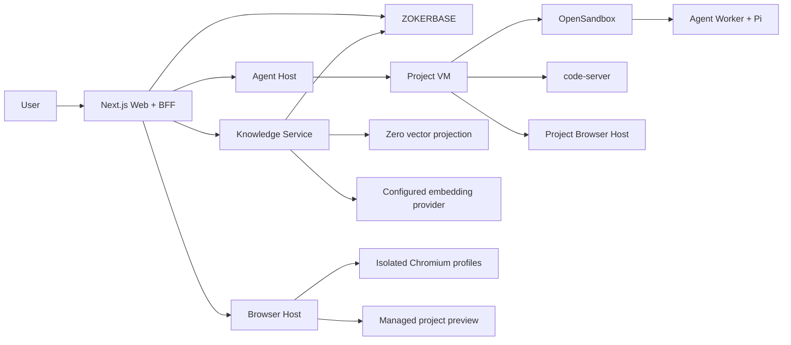
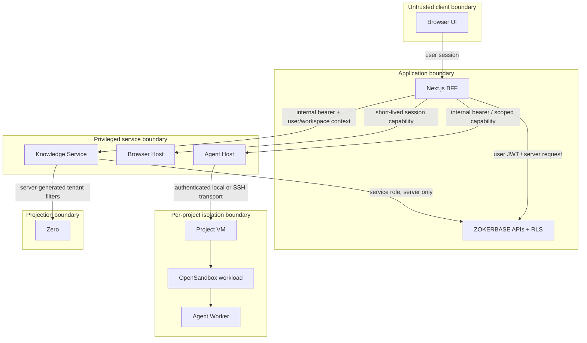

# System context and component model

## System overview



The browser-facing application is a control and presentation plane. It does
not own long-running privileged work. Dedicated services own runtimes and
return typed state/events through authenticated boundaries.

## Component responsibilities

| Component | Owns | Must not own |
| --- | --- | --- |
| Next.js Web/BFF | SSR, UI, session validation, request shaping, short-lived BFF routes | VM lifecycle, shell execution, raw SSH, Zero credentials, service-role secrets in clients |
| ZOKERBASE | Auth, PostgreSQL data, RLS, REST, Realtime, Storage, migrations | Project filesystem, live agent process, vector similarity runtime |
| Agent Host | Project VM orchestration, Worker leases, policy compilation, Pi event transport | Product UI, browser session rendering, authoritative application records |
| Agent Worker / Pi | One chat session's model/tool execution and native JSONL stream | Cross-tenant authorization, host-wide runtime control |
| Browser Host | Native preview gateway, isolated Chromium, CDP actions, control leases | Application identity source, Project VM ownership |
| Knowledge Service | Knowledge authorization, ingestion, chunking, embedding calls, Zero filters, deployment jobs | Browser credentials, direct client exposure of Zero or ZOKERBASE service-role access |
| Zero | Vector entities and similarity indexes | User identity, permissions, source documents, API keys |
| Project VM | `/workspace`, project Git repository, project services, per-session sandboxes | Cross-project data or application identity |
| code-server | Project-scoped editor surface inside the Project VM | Authentication authority outside its signed gateway |

## Trust boundaries



Every boundary must authenticate its caller and reconstruct authorization from
trusted identity/workspace context. Caller-supplied tenant filters, service
endpoints, shell strings, and credential material are not trusted.

## Primary data flows

### Chat execution

```text
authenticated chat page
  → warm Worker lease
  → ensure Project VM and project services are ready
  → create/resume session Worker
  → send prompt through Agent Host
  → stream normalized Pi/tool events
  → atomically persist ordered events and Pi JSONL
  → render one timeline
```

### Browser execution

```text
user or Agent action
  → scoped browser-session capability
  → Browser Host control lease
  → native-preview or chromium-stream surface
  → normalized observation/event
  → Web UI and Agent consume the same Browser Protocol
```

### Knowledge ingestion and search

```text
source document
  → BFF resolves the user's configured embedding provider
  → Knowledge Service validates workspace access
  → ZOKERBASE document + job
  → deterministic chunks
  → real configured embedding model
  → Zero vector projection
  → ZOKERBASE ready state

query
  → embed with the same provider/model/dimension
  → Zero search with server-generated workspace + collection filter
  → hydrate citations from ZOKERBASE
```

Without a configured real embedding provider, ingestion and search are not
available. Zero health alone does not mean an embedding model is installed.

## Default local endpoints

These are development defaults, not public APIs:

| Endpoint | Purpose |
| --- | --- |
| `127.0.0.1:3000` | Web application |
| `127.0.0.1:43120` | Browser Host |
| `127.0.0.1:43121` | Web/Project VM Agent Host |
| `127.0.0.1:43123` | Desktop sandbox-runtime Agent Host |
| `127.0.0.1:43124` | Knowledge Service |
| `127.0.0.1:54380` | Local ZOKERBASE gateway |
| `127.0.0.1:19530` | Zero internal vector endpoint |
| `127.0.0.1:9091` | Zero health endpoint |

Privileged endpoints bind to loopback by default. Remote deployments expose
only authenticated gateways or strict-host-key-checked tunnels.
