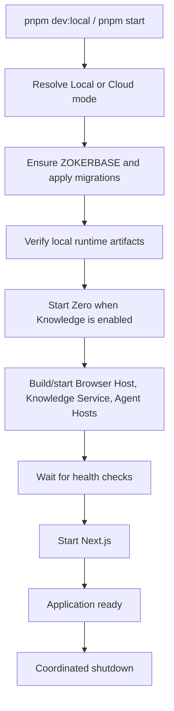
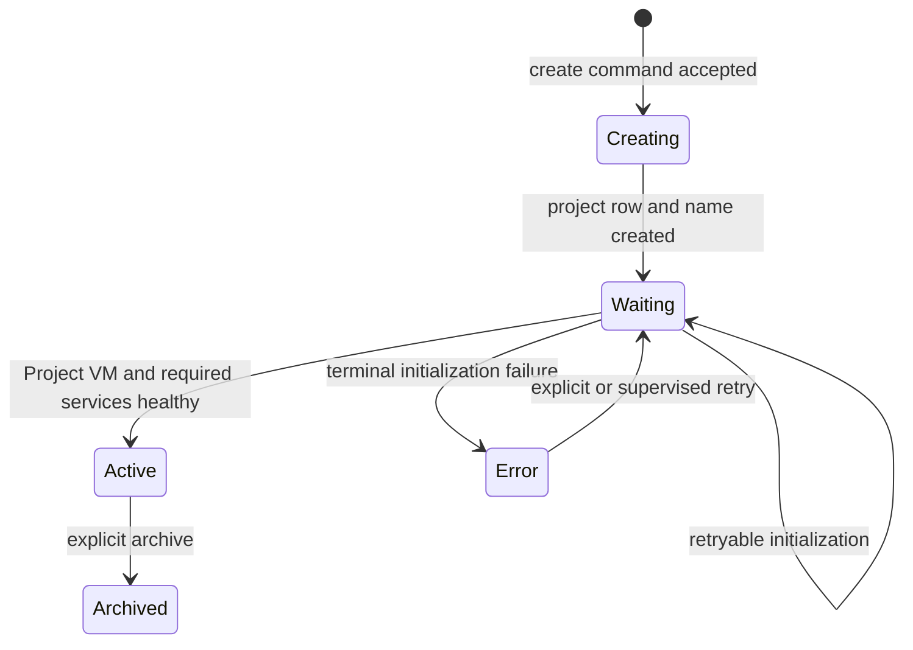

# Runtime and lifecycle standards

## Root lifecycle

`scripts/openlink.mjs` is the supported root entry point. It delegates to the
current supervisor implementation and owns the complete application lifecycle.

Startup must be observable. A long operation must either emit progress or
surface a concrete blocking dependency; silent waiting is not a readiness
signal.

## Local mode

Local mode starts a complete, independent backend domain:

- ZOKERBASE Auth, PostgreSQL, REST, Realtime, Storage, gateway, and Studio;
- Browser Host and Agent Host service profiles;
- Zero Standalone and Knowledge Service;
- Project VM infrastructure and product-owned runtime images;
- Next.js Web/BFF.

Initialization generates required secrets once, persists them under protected
runtime state, applies migrations in order, and reuses them on later starts.
On Windows, credential state is rooted in `%LOCALAPPDATA%\OpenLink\state` and
is not co-located with the Hyper-V-accessible `.openlink-runtime` VM-storage
tree. macOS retains the established repository-local runtime layout.
Users may change settings after initialization; first boot does not require
manual secret entry.

## Cloud mode

Cloud mode uses deployed instances of the same contracts. It does not weaken
tenant checks or introduce a second application code path for business logic.
Cloud storage topology may evolve independently, but a change must preserve the
documented service contracts or ship an explicit version/migration.

## Project lifecycle

- Default personal-project provisioning starts as soon as personal onboarding
  is complete.
- If organization onboarding continues, its default project starts when that
  organization is created; it does not wait for unrelated onboarding steps.
- Chat creation and entry are disabled until both project status and runtime
  status are ready.
- A remote/SSH project is permanently typed as remote. Its execution location
  is not silently changed to Local after creation.

## Project VM lifecycle

A Project VM is durable per project. The published local base image is produced
once and then copied/instantiated; ordinary runtime startup does not pull a
machine OS or rebuild the base image.

Thin local Project VM disks are instantiated by Agent Host through a verified
provider-native child of the immutable Golden Disk. Podman owns machine
configuration, Ignition, SSH identity and provider metadata, but must not copy
the real Golden Disk through its custom-image path. macOS AppleHV uses a staged
native APFS clone of the sparse raw Golden Disk; Windows Hyper-V uses a staged
differencing VHDX whose parent is the dynamic Golden VHDX. The VM remains
stopped until logical size, parent/clone identity and host allocation checks
pass. Unsupported providers or filesystems fail thin provisioning explicitly;
they never trigger an implicit thick copy or WSL fallback. The guest Golden
Disk keeps its GRUB-readable `/boot` on ext4 and its root/data on XFS so the
same VM disk remains bootable across provider power cycles.

The Project VM owns:

- `/workspace` and its Git repository;
- OpenSandbox and the project Podman socket;
- code-server;
- project Browser Host/runtime services;
- per-session sandbox workloads.

It also owns one independent `ProjectSupabaseRuntime` for application data:

- the complete reviewed upstream Supabase self-hosted default stack runs as
  rootful Podman containers inside the Project VM;
- the Golden Disk already contains every locked service image in
  `/var/lib/containers/storage`; first boot verifies and starts those images
  and never pulls/imports them;
- secrets, PostgreSQL, Storage, Functions, configuration and observed state
  are unique to that Project VM and survive Agent Worker and VM restarts;
- readiness requires every enabled Supabase service, not only PostgreSQL or a
  running process;
- explicit upgrades are serialized, signed, architecture-locked, capacity
  checked, backed up and either committed after full health or rolled back to
  the retained old image/data set.

ZOKERBASE is not an input, compatibility fork, data source, secret source or
upgrade authority for `ProjectSupabaseRuntime`. It remains the OpenLink control
plane while this runtime is the generated application's backend.

While the application is running, inactivity may suspend/pause a VM only when
the selected runtime supports fast state-preserving resume. Session cleanup
must never delete or physically power off the Project VM.

## Session Worker lifecycle

One Worker lease is keyed by user, workspace, chat session, model/provider
revision, and browser binding. Opening a ready chat warms the Worker. Sending a
prompt is idempotent and may rebuild the Worker from the durable Pi snapshot if
warmup failed.

Idle Workers pause when supported. Destructive cleanup is reserved for:

- explicit application/session shutdown;
- incompatible model/provider/browser identity change;
- failed recovery;
- stale workloads left by a previous supervisor process.

## Browser lifecycle

Browser Host owns persistent profiles and detects approved running project
ports. Browser sessions must recover stale Chromium singleton locks only after
confirming no live process owns the profile. A profile is session-scoped; two
concurrent Chromium processes must not write the same profile.

Both native preview and real-time Chromium surfaces use the same Browser
Protocol and capability model. Human interaction has priority over the Agent's
control lease.

## Knowledge lifecycle

Zero is application-level infrastructure, not a Project VM dependency.
Knowledge Service starts only after ZOKERBASE and Zero are healthy. It owns
ingestion/search contracts and may operate against Standalone or Distributed
Zero.

Changing Standalone to Distributed is a deploy-migrate-validate-cutover
workflow. It does not mutate a Standalone process in place and retains a
rollback path until validation succeeds.

## Shutdown and restart

Shutdown order prevents new work before dependencies disappear:

1. stop accepting new Web/BFF work;
2. stop/resume-safe session Workers and Agent Hosts;
3. stop Knowledge and Browser services;
4. stop application-owned local infrastructure when the product is actually
   exiting;
5. preserve durable database, Zero, profile, and Project VM state.

A development restart must terminate the previous root supervisor and let it
perform coordinated cleanup before a new supervisor starts. Do not leave two
instances competing for the same ports, profile directories, or VM state.
